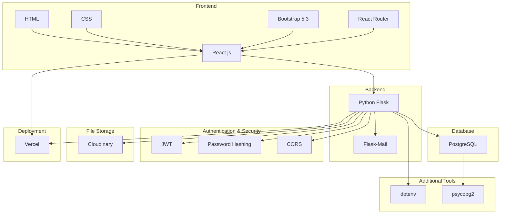

# FreelanceHub

Una aplicación full-stack para gestionar todos tus proyectos como freelancer, diseñada para optimizar tus flujos, recordar plazos y asegurar pagos a tiempo. Desarrollada como proyecto de graduación para 4Geeks Academy bootcamp.

## Descripción del Proyecto

FreelanceHub es una aplicación diseñada para ayudar a freelancers a gestionar contratos, tareas y pagos de manera eficiente y organizada. La plataforma permite a los freelancers crear y administrar contratos, realizar seguimientos de tareas, pagos y mantener un registro organizado.

## Arquitectura Técnica



## Funcionalidades Principales

- Registro y autenticación de usuarios
- Gestión de clientes
- Registro y seguimiento de proyectos
- Sistema de tareas con recordatorios
- Seguimiento de pagos
- Generación y gestión de contratos
- Sistema de notificaciones por email
- Diseño responsivo

## Tech Stack

### Backend

- Python Flask
- PostgreSQL
- JWT para autenticación
- CORS para seguridad cross-origin
- Cloudinary para almacenamiento de archivos
- Flask-Mail para notificaciones por email
- Schedule para automatización de tareas
- psycopg2 para conectividad con base de datos

### Frontend

- React.js
- Bootstrap 5.3
- React Router para navegación
- Vercel para deployment

## Modelo de Base de Datos

El sistema utiliza PostgreSQL con las siguientes tablas principales:

- usuarios (Users)
- clientes (Clients)
- proyectos (Projects)
- tareas (Tasks)
- pagos (Payments)
- plantillas (Templates)
- contratos (Contracts)

## Instalación

1. Clonar el repositorio:

```bash
git clone [repository-url]
```

2. Instalar dependencias del backend:

```bash
cd backend
pip install -r requirements.txt
```

3. Configurar variables de entorno:
   Crear archivo `.env` en el directorio backend con las siguientes variables:

```
DATABASE_NAME=
DATABASE_USER=
DATABASE_PASSWORD=
DATABASE_HOST=
DATABASE_PORT=
JWT_SECRET=
CLOUDINARY_CLOUD_NAME=
CLOUDINARY_API_KEY=
CLOUDINARY_API_SECRET=
MAIL_SERVER=
MAIL_PORT=
MAIL_USERNAME=
MAIL_PASSWORD=
MAIL_DEFAULT_SENDER_NAME=
MAIL_DEFAULT_SENDER_EMAIL=
```

4. Instalar dependencias del frontend:

```bash
cd frontend
npm install
```

5. Iniciar servidores de desarrollo:

Backend:

```bash
python index.py
```

Frontend:

```bash
npm run dev
```

## API Endpoints

### Usuarios

- POST `/register-usuario` - Registro de nuevo usuario
- POST `/login-usuario` - Login de usuario
- PATCH `/usuario/:id/update` - Actualizar perfil
- PATCH `/usuario/:id/update-password` - Actualizar contraseña

### Proyectos

- GET `/proyectos/:user_id` - Obtener proyectos de usuario
- POST `/create-proyecto` - Crear nuevo proyecto
- GET `/proyecto/:id` - Obtener proyecto específico
- PATCH `/proyecto/:id` - Actualizar proyecto
- DELETE `/proyecto/:id` - Eliminar proyecto

### Tareas

- GET `/tareas/:proyecto_id` - Obtener tareas de un proyecto
- POST `/create-tarea` - Crear nueva tarea
- GET `/tarea/:id` - Obtener tarea específica
- PATCH `/tarea/:id` - Actualizar tarea
- DELETE `/tarea/:id` - Eliminar tarea

### Pagos

- POST `/create-pago` - Crear nuevo pago
- GET `/pagos/:proyecto_id` - Obtener pagos de un proyecto
- PATCH `/pago/:id` - Actualizar pago
- DELETE `/pago/:id` - Eliminar pago

## Desafíos Técnicos y Soluciones

- Deployment y caída de la API
- Manejo de tiempo con horarios rotativos
- Navegación de documentación de librerías externas
- Implementación de OTP (One-Time Password)

## FreelanceHub 2.0: Futuras Mejoras

- Generación de boletas o facturas
- Enfoque Mobile First
- Integración de sistemas de pago
- Calculadora Freelance
- Block de notas con registro de pagos

## Deployment

La aplicación está desplegada usando:

- Backend: Flask server
- Frontend: Vercel (freelancehub.cl)
- API: api-freelancehub.vercel.app
- Base de datos: PostgreSQL

## Contributors

- Front-end Developer: Jeneydis Molina
- Team Lead & Back-end Developer: Max Ihnen

## License

Este proyecto está licenciado bajo MIT License - ver el archivo LICENSE.md para detalles.
