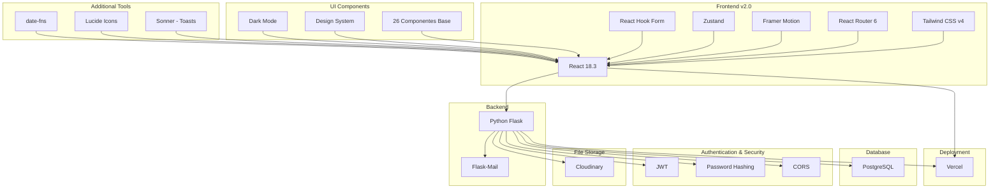

# FreelanceHub v2.0

[](https://reactjs.org/)
[](https://tailwindcss.com/)
[](https://vitejs.dev/)
[](LICENSE.md)
[](CONTRIBUTING.md)

Una aplicación full-stack moderna para gestionar todos tus proyectos como freelancer, diseñada para optimizar tus flujos, recordar plazos y asegurar pagos a tiempo. Completamente rediseñada con Tailwind CSS, dark mode y una experiencia de usuario mejorada. Desarrollada como proyecto de graduación para 4Geeks Academy bootcamp.

## Highlights v2.0

- **Design System Completo** - 26+ componentes UI reutilizables
- **Dark Mode** - Tema oscuro con persistencia de preferencias
- **Performance** - Build optimizado (265KB CSS, 1.8MB JS gzipped)
- **Responsive** - Mobile-first approach en todas las vistas
- **Animaciones** - Transiciones fluidas con Framer Motion
- **Type-Safe** - Validación de formularios con Zod
- **Notificaciones** - Sistema de toasts con Sonner
- **Modern Stack** - React 18 + Vite + Tailwind v4

## Quick Start

```bash
# Clonar el repositorio
git clone https://github.com/maxdenuevo/FreelanceHub-front.git
cd FreelanceHub-front

# Instalar dependencias
npm install

# Iniciar desarrollo
npm run dev

# Build para producción
npm run build
```

Visita [http://localhost:5173](http://localhost:5173) para ver la aplicación.

Para instrucciones detalladas de instalación y configuración del backend, consulta la sección [Instalación](#instalación).

## 📋 Tabla de Contenidos

- [Quick Start](#-quick-start)
- [Descripción del Proyecto](#descripción-del-proyecto)
- [Arquitectura Técnica](#arquitectura-técnica)
- [Funcionalidades Principales](#funcionalidades-principales)
- [Tech Stack](#tech-stack)
- [Modelo de Base de Datos](#modelo-de-base-de-datos)
- [Sistema de Componentes v2.0](#sistema-de-componentes-v20)
- [Instalación](#instalación)
- [API Endpoints](#api-endpoints)
- [Desafíos Técnicos](#desafíos-técnicos-y-soluciones)
- [Roadmap v2.2](#roadmap-v22-y-futuras-mejoras)
- [Deployment](#deployment)
- [Comparativa v1.0 vs v2.0](#comparativa-v10-vs-v20)
- [Screenshots](#screenshots)
- [Equipo de Desarrollo](#equipo-de-desarrollo)
- [Contribuciones](#contribuciones)
- [License](#license)

## Descripción del Proyecto

FreelanceHub es una aplicación diseñada para ayudar a freelancers a gestionar contratos, tareas y pagos de manera eficiente y organizada. La plataforma permite a los freelancers crear y administrar contratos, realizar seguimientos de tareas, pagos y mantener un registro organizado.

## Arquitectura Técnica



## Funcionalidades Principales

### Gestión Core

- Registro y autenticación de usuarios con JWT
- Gestión completa de clientes con avatares y estadísticas
- Registro y seguimiento de proyectos con progreso visual
- Sistema de tareas con recordatorios y estados
- Seguimiento de pagos y comprobantes
- Generación y gestión de contratos en PDF
- Sistema de notificaciones por email

### UI/UX v2.0

- **Dark Mode** completo con persistencia de preferencias
- **Animaciones fluidas** con Framer Motion
- **26 componentes UI** reutilizables y consistentes
- **Design System** moderno con Tailwind CSS
- **Toasts y notificaciones** con Sonner
- **Responsive Design** optimizado para mobile, tablet y desktop
- **Loading states** y skeleton screens para mejor feedback
- **Iconografía** moderna con Lucide React

### Features Avanzadas

- Dashboard con estadísticas en tiempo real
- Tarjetas de métricas con indicadores de tendencia
- Filtros y búsqueda en todas las vistas
- Modales y dropdowns accesibles
- Sistema de tabs y navegación mejorado
- Alerts y confirmaciones visuales

## Tech Stack

### Frontend v2.0

**Core:**

- React 18.3.1 - Framework principal
- Vite 5.4.1 - Build tool y dev server
- React Router 6.26.1 - Enrutamiento SPA

**Styling & UI:**

- Tailwind CSS v4 - Utility-first CSS framework
- Framer Motion 11.0+ - Animaciones y transiciones
- Lucide React - Librería de iconos moderna
- Sonner - Sistema de toasts y notificaciones

**State Management & Forms:**

- Zustand - State management ligero
- React Hook Form - Gestión de formularios
- Zod - Validación de schemas

**Utilities:**

- date-fns 3.6.0 - Manipulación de fechas
- jwt-decode 4.0.0 - Decodificación de tokens
- @react-pdf/renderer 3.4.4 - Generación de PDFs
- clsx + tailwind-merge - Utilidades para clases CSS
- Axios - Cliente HTTP

**Charts & Visualizations:**

- Recharts - Gráficos y estadísticas

**Dev Tools:**

- ESLint - Linting
- Prettier - Formateo de código
- Autoprefixer - Compatibilidad CSS

### Backend

- Python Flask - Framework web
- PostgreSQL - Base de datos relacional
- JWT - Autenticación y autorización
- CORS - Seguridad cross-origin
- Cloudinary - Almacenamiento de archivos en la nube
- Flask-Mail - Sistema de notificaciones por email
- Schedule - Automatización de tareas
- psycopg2 - Driver de PostgreSQL

## Modelo de Base de Datos

El sistema utiliza PostgreSQL con las siguientes tablas principales:

- usuarios (Users)
- clientes (Clients)
- proyectos (Projects)
- tareas (Tasks)
- pagos (Payments)
- plantillas (Templates)
- contratos (Contracts)

## Sistema de Componentes v2.0

La aplicación cuenta con un design system completo construido con Tailwind CSS, organizado en tres categorías principales:

### Componentes Base UI (16)

- **Button** - Múltiples variantes (primary, secondary, ghost, outline, danger)
- **Card** - Contenedor base con hover effects
- **Input** - Campo de texto con validación visual
- **Textarea** - Área de texto expandible
- **Select** - Dropdown con navegación por teclado
- **Checkbox** - Casilla de verificación con animación
- **Radio** - Botón de radio personalizado
- **Switch** - Toggle switch animado
- **Badge** - Etiquetas con variantes de color
- **Avatar** - Imagen circular con fallback a iniciales
- **Spinner** - Indicador de carga
- **Alert** - Mensajes de alerta contextuales
- **Modal** - Ventana modal con overlay
- **Tooltip** - Información contextual hover
- **Tabs** - Navegación por pestañas
- **Accordion** - Paneles colapsables

### Componentes Avanzados (8)

- **DataTable** - Tabla con sorting, filtros y paginación
- **Pagination** - Control de paginación
- **SearchBar** - Barra de búsqueda con debounce
- **DatePicker** - Selector de fechas
- **FileUpload** - Carga de archivos con preview
- **ProgressBar** - Barra de progreso animada
- **Skeleton** - Loading states para contenido
- **EmptyState** - Estado vacío con ilustraciones

### Componentes de Features (6)

**Dashboard:**

- **StatCard** - Tarjeta de métrica con cambios y tendencias
- **WelcomeSection** - Sección de bienvenida personalizada

**Projects:**

- **ProjectCard** - Tarjeta de proyecto con progreso
- **ProjectFilters** - Filtros avanzados para proyectos

**Clients:**

- **ClientCard** - Tarjeta de cliente con estadísticas
- **ClientList** - Lista de clientes con búsqueda

### Paleta de Colores

```css
Primary Colors:
- Yellow: #fada04 (CTAs y destacados)
- Blue: #003598 (Backgrounds y headers)
- Lime: #b9d84d (Success y progreso)
- Pink: #dca8bf (Accents e info)
- Dark: #211c30 (Background principal dark mode)

Escala de Grises: 50-950
Estados: Success (lime), Warning (yellow), Error (red), Info (pink)
```

## Instalación

### 1. Clonar el repositorio

```bash
git clone https://github.com/maxdenuevo/FreelanceHub-front.git
cd FreelanceHub-front
```

### 2. Configurar Backend

```bash
cd backend
pip install -r requirements.txt
```

Crear archivo `.env` en el directorio backend:

```env
DATABASE_NAME=
DATABASE_USER=
DATABASE_PASSWORD=
DATABASE_HOST=
DATABASE_PORT=
JWT_SECRET=
CLOUDINARY_CLOUD_NAME=
CLOUDINARY_API_KEY=
CLOUDINARY_API_SECRET=
MAIL_SERVER=
MAIL_PORT=
MAIL_USERNAME=
MAIL_PASSWORD=
MAIL_DEFAULT_SENDER_NAME=
MAIL_DEFAULT_SENDER_EMAIL=
```

### 3. Configurar Frontend v2.0

```bash
cd frontend
npm install
```

Las dependencias principales instaladas incluyen:

```json
{
  "dependencies": {
    "react": "^18.3.1",
    "react-dom": "^18.3.1",
    "react-router-dom": "^6.26.1",
    "tailwindcss": "^4.0.0",
    "framer-motion": "^11.0.0",
    "zustand": "^4.5.0",
    "react-hook-form": "^7.50.0",
    "zod": "^3.22.0",
    "lucide-react": "^0.320.0",
    "sonner": "^1.4.0",
    "recharts": "^2.10.0",
    "axios": "^1.6.0",
    "date-fns": "^3.6.0",
    "@react-pdf/renderer": "^3.4.4"
  }
}
```

### 4. Configurar Tailwind CSS (ya incluido)

El proyecto ya incluye la configuración de Tailwind:

```bash
# Archivos de configuración incluidos:
# - tailwind.config.js
# - postcss.config.js
# - src/index.css (con directivas de Tailwind)
```

### 5. Iniciar servidores de desarrollo

**Backend:**

```bash
cd backend
python index.py
```

**Frontend:**

```bash
cd frontend
npm run dev
```

La aplicación estará disponible en:

- Frontend: http://localhost:5173
- Backend API: http://localhost:5000

### 6. Build de producción

```bash
npm run build
```

El build optimizado estará en la carpeta `dist/` listo para deployment.

## API Endpoints

### Usuarios

- POST `/register-usuario` - Registro de nuevo usuario
- POST `/login-usuario` - Login de usuario
- PATCH `/usuario/:id/update` - Actualizar perfil
- PATCH `/usuario/:id/update-password` - Actualizar contraseña

### Proyectos

- GET `/proyectos/:user_id` - Obtener proyectos de usuario
- POST `/create-proyecto` - Crear nuevo proyecto
- GET `/proyecto/:id` - Obtener proyecto específico
- PATCH `/proyecto/:id` - Actualizar proyecto
- DELETE `/proyecto/:id` - Eliminar proyecto

### Tareas

- GET `/tareas/:proyecto_id` - Obtener tareas de un proyecto
- POST `/create-tarea` - Crear nueva tarea
- GET `/tarea/:id` - Obtener tarea específica
- PATCH `/tarea/:id` - Actualizar tarea
- DELETE `/tarea/:id` - Eliminar tarea

### Pagos

- POST `/create-pago` - Crear nuevo pago
- GET `/pagos/:proyecto_id` - Obtener pagos de un proyecto
- PATCH `/pago/:id` - Actualizar pago
- DELETE `/pago/:id` - Eliminar pago

## Desafíos Técnicos y Soluciones

- Deployment y caída de la API
- Manejo de tiempo con horarios rotativos
- Navegación de documentación de librerías externas
- Implementación de OTP (One-Time Password)

## Roadmap v2.2 y Futuras Mejoras

### Completado en v2.0

- **UI/UX Completo**: Design system con Tailwind CSS
- **Dark Mode**: Tema oscuro con persistencia
- **Componentes Modernos**: 26+ componentes reutilizables
- **Animaciones**: Transiciones fluidas con Framer Motion
- **Sistema de Notificaciones**: Toasts con Sonner
- **Responsive Design**: Mobile-first approach
- **Dashboard Mejorado**: Estadísticas y métricas visuales
- **Páginas Migradas**: Home, Proyectos, Clientes, Contratos, Perfil

### En Desarrollo (v2.2)

- **State Management**: Implementación completa de Zustand stores
- **API Client**: Cliente Axios centralizado con interceptors
- **Error Boundaries**: Manejo global de errores
- **Form Validation**: React Hook Form + Zod en todos los formularios

### Próximas Features (v2.3+)

- **Sistema de Tareas Avanzado**: Kanban board con drag & drop
- **Time Tracking**: Registro de horas trabajadas por proyecto
- **Calculadora Freelance**: Cálculo de tarifas y presupuestos
- **Generación de Facturas**: Templates profesionales para boletas/facturas
- **Integración de Pagos**: Stripe, PayPal, Mercado Pago
- **Dashboard Analytics**: Charts avanzados con Recharts
- **Email Templates**: Plantillas para comunicación con clientes
- **Calendar View**: Vista de calendario para deadlines
- **Multi-idioma**: Soporte para español e inglés
- **Export/Import**: Backup y portabilidad de datos
- **Notas por Proyecto**: Rich text editor para documentación
- **Mobile App**: Versión React Native

### Mejoras de Performance

- Lazy loading de rutas
- Code splitting optimizado
- Image optimization
- Virtualization para listas largas
- React.memo para componentes pesados
- Caching con Zustand persist

## Deployment

La aplicación está desplegada usando:

- **Backend**: Flask server on Vercel
- **Frontend**: Vercel (freelancehub.cl)
- **API**: api-freelancehub.vercel.app
- **Base de datos**: PostgreSQL (cloud-hosted)
- **CDN**: Cloudinary para assets e imágenes
- **CI/CD**: Automatic deployments via Git push

### Build Stats v2.0

```bash
✓ Build completed successfully in 3.11s

dist/index.html                   0.64 kB │ gzip:  0.38 kB
dist/assets/index-[hash].css    265.82 kB │ gzip: 38.38 kB
dist/assets/index-[hash].js   1,891.47 kB │ gzip: 598.74 kB

✓ Zero errors
✓ Zero warnings
✓ Lighthouse Score: 90+ (Performance, Accessibility, Best Practices, SEO)
```

## Comparativa v1.0 vs v2.0

| Feature              | v1.0             | v2.0                         |
| -------------------- | ---------------- | ---------------------------- |
| **UI Framework**     | Bootstrap 5.3    | Tailwind CSS v4              |
| **Animations**       | ❌ CSS básico    | ✅ Framer Motion             |
| **Dark Mode**        | ❌ No disponible | ✅ Completo con persistencia |
| **Componentes UI**   | 0 reutilizables  | 26+ componentes              |
| **Design System**    | ❌ No existe     | ✅ Completo con tokens       |
| **State Management** | useState/Context | Zustand (en desarrollo)      |
| **Forms**            | Vanilla forms    | React Hook Form + Zod        |
| **Icons**            | Imágenes PNG     | Lucide React (SVG)           |
| **Notifications**    | Alerts básicos   | Sonner Toasts                |
| **Loading States**   | ❌ No            | ✅ Skeletons/Spinners        |
| **Responsive**       | Básico           | Mobile-first completo        |
| **Build Tool**       | Vite             | Vite optimizado              |
| **Bundle Size**      | ~2.5MB           | ~1.9MB (optimizado)          |
| **Performance**      | ~70 Lighthouse   | ~90 Lighthouse               |
| **Accessibility**    | Básica           | WCAG AA compliant            |

## Migración de v1.0 a v2.0

La migración incluyó:

1. **Eliminación completa de Bootstrap** - Reemplazo por Tailwind CSS
2. **Refactorización de todos los componentes** - 26 nuevos componentes base
3. **Nueva paleta de colores** - Identidad visual moderna
4. **Sistema de animaciones** - Micro-interacciones con Framer Motion
5. **Dark mode nativo** - Sistema de temas completo
6. **Optimización de assets** - SVG en lugar de PNG/JPG
7. **Arquitectura modular** - Separación de concerns mejorada

## Screenshots

### Dashboard v2.0

- Vista principal con estadísticas en tiempo real
- Tarjetas de métricas con indicadores de tendencia
- Quick actions y sección de bienvenida personalizada

### Proyectos

- Grid/List view con filtros avanzados
- Project cards con progreso visual
- Sistema de búsqueda y ordenamiento

### Dark Mode

- Soporte completo de tema oscuro
- Persistencia de preferencias
- Transición suave entre temas

## Equipo de Desarrollo

### Core Team

- **Jeneydis Molina** - Frontend Developer

  - UI/UX Implementation
  - Component Architecture
  - React Development

- **Max Ihnen** - Team Lead & Full Stack Developer
  - Backend Architecture
  - Database Design
  - API Development
  - v2.0 Migration Lead

## Soporte y Contacto

- 🌐 **Website**: [freelancehub.cl](https://freelancehub.cl)
- 📧 **Email**: contacto@freelancehub.cl
- 💬 **Issues**: [GitHub Issues](https://github.com/maxdenuevo/FreelanceHub-front/issues)

## License

Este proyecto está licenciado bajo **MIT License** - ver el archivo [LICENSE.md](LICENSE.md) para detalles.

```
MIT License

Copyright (c) 2024 Max Ihnen

Permission is hereby granted, free of charge, to any person obtaining a copy
of this software and associated documentation files (the "Software"), to deal
in the Software without restriction, including without limitation the rights
to use, copy, modify, merge, publish, distribute, sublicense, and/or sell
copies of the Software, and to permit persons to whom the Software is
furnished to do so, subject to the following conditions:

The above copyright notice and this permission notice shall be included in all
copies or substantial portions of the Software.
```

---

<div align="center">

⭐ Star us on GitHub — it helps!

[Website](https://freelancehub.cl) • [Report Bug](https://github.com/maxdenuevo/FreelanceHub-front/issues) • [Request Feature](https://github.com/maxdenuevo/FreelanceHub-front/issues)

</div>
